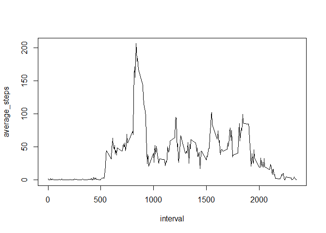

# Reproducible Research: Peer Assessment 1


## Loading and preprocessing the data


```r
setwd('C:/Users/Mas Mobiliario SAS/datasciencecoursera/RepData_PeerAssessment1')
unzip('activity.zip', file = 'activity.csv')
datos = read.csv('activity.csv', header = TRUE)
library(data.table)
```

```
## Warning: package 'data.table' was built under R version 3.2.5
```

```r
datos = as.data.table(datos)
datos$date = as.Date(as.character(datos$date), "%Y-%m-%d")
```

## What is mean total number of steps taken per day?


```r
a = datos[, sum(na.omit(steps)), by = date]
names(a) = c('date', 'steps_per_day')
library(ggplot2)
ggplot(data = a , aes(steps_per_day)) + geom_histogram(binwidth = 3000, fill = 'red')
```

<!-- -->

Mean and median of the total steps per day

```r
mean_a = mean(na.omit(a$steps_per_day))
median = quantile(a$steps_per_day, 0.5)
```

## What is the average daily activity pattern?

Steps per day mean is 


```
## [1] 9354.23
```

Steps per day median is 


```
##   50% 
## 10395
```


Average number of steps per interval


```r
b = datos[, mean(na.omit(steps)), by = interval]
names(b) = c('interval','average_steps')
with(b, plot(interval, average_steps, type = "l")) 
```

<!-- -->


```r
maximum_interval = b$interval[which.max(b$average_steps)]
maximum_interval
```

```
## [1] 835
```
## Imputing missing values

Number of NAs in the data set


```r
number_of_nas = sum(sapply(t(datos), function(x){any(is.na(x))}))
number_of_nas
```

```
## [1] 2304
```

Missing values are filled with the five minutes interval median.


```r
medians = datos[, medians := median(na.omit(steps)), by = interval ]
medians[, new_steps:= ifelse(is.na(steps), medians, steps)] 
```


Histogram of the total steps per day

```r
a = medians[, sum(na.omit(new_steps)), by = date]
names(a) = c('date', 'steps_per_day')
b = medians[, sum(na.omit(steps)), by = date]
library(ggplot2)
ggplot(data = a , aes(steps_per_day)) + geom_histogram(binwidth = 3000, fill = 'red')
```

<!-- -->

As median is used, ther is not a significante change in the histogram with respect to the unimputated. 


## Are there differences in activity patterns between weekdays and weekends?


```r
medians[, weekend := ifelse(weekdays(date) %in% c('sábado','domingo'), 'weekend','weekday'),]

b = datos[, mean(na.omit(steps)), by = list(interval,weekend)]
names(b) = c('interval','weekend','average_steps')
library(lattice)
with(b, xyplot(average_steps  ~ interval | weekend , layout = c(1,2), type = "l")) 
```

<!-- -->
